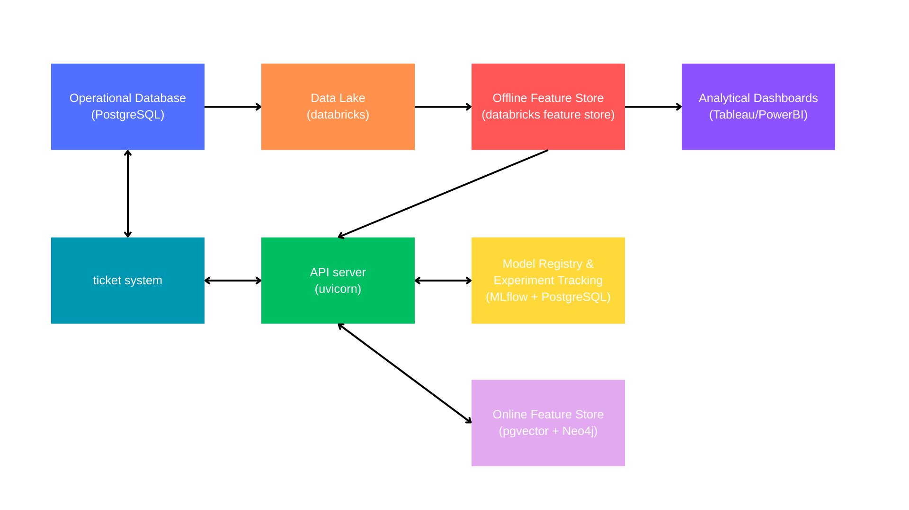

# Architecture Documentation

This document describes the architecture choices for the intelligent support system.
Since a real production solution requires significant time and infrastructure to implement, this document
describes both the ideal production architecture and the implemented solution, explaining the
design choices and compromises made.


## Ideal Architecture

The ideal architecture must satisfy two main requirements:
- Training and versioning of machine learning models
- Real-time inference at ticket creation time

For model training, we need to store historical ticket data, transform it into features, run ML
experiments, and store the resulting models. This work is done by AI Engineers and Data Scientists
during business hours, or as scheduled batch jobs at night to retrain production models on fresh data.
The training infrastructure does not need ultra-low latency, but it does need to handle very large
data volumes reliably.

For inference, the requirements are the opposite: low latency is needed, but data volume per request is
small. 

The chosen schema is the following:



Disclaimer: The technologies named below are examples. In practice, the right choices
depend on budget, team composition, technologies already in use, and security and compliance
requirements. All these variables should be analyzed before committing to a specific stack.


### Ticket System

The support ticket application where customers and agents create and manage tickets. 

### Operational Database

The ticket system's current database. It stores all current ticket and customer records. I assume it
already exists in the system and it is probably a standard relational database such as PostgreSQL.

### Data Lake

Historical ticket data is stored raw in a Data Lake for use in model training. Every day, new
records are collected from the Operational Database and added here. Data quality monitoring begins
at this layer, with data stewards able to control the raw data.

For this layer I chose Databricks because it can handle very large data volumes, it is an ML-first
platform, it integrates natively with MLflow, and it supports both batch and streaming workloads through
Delta Lake. I compared it to Snowflake, but Snowflake is more limited for ML experimentation and
custom Python workflows. The trade-off with Databricks is higher operational complexity and setup cost.

### Offline Feature Store

The offline feature store stores processed, engineered features derived from the raw data lake. They are clean,
versioned, and ready for model training and BI analytics. It separates feature computation from model
training, enabling feature reuse across experiments and teams.

For this I chose the Databricks Feature Store for its native integration with the data lake and
MLflow. However, some alternative options could be:

- Feast : open source with no vendor lock-in, but requires more infrastructure management.
- Tecton : a managed, enterprise-grade platform with real-time serving capabilities and a good
  developer experience, but comes with higher cost and vendor lock-in.

This data is accessed both by training pipelines and by BI tools for reporting on business metrics
(resolution times, satisfaction drivers, agent performance, etc.).

### Model Registry and Experiment Tracking

This component has two purposes: recording all information about each training run (metrics,
parameters, artifacts), and managing model versions with clear lifecycle states (staging, production,
archived).

For this I chose MLflow because it is open source, integrates natively with
Databricks, and supports the full model lifecycle : experiment tracking, artifact storage, model
registry, and production promotion through aliases. The API loads whichever model version carries the
`"production"` alias at startup, making deployment and training independent.

### API Server

The ticket system calls the API server when a new ticket is created to receive:
1. A predicted category (from the classification model)
2. Similar past tickets and suggested resolutions (from the RAG system)

All information needed for inference is assumed to be present in the ticket at creation time.
However, if that wasn't the case, the API could query the operational database for supplementary data, 
or the online feature store for pre-calculated features.

With ~500 new tickets per day (roughly one per minute), the concurrency is low enough that a
standard Python API is more than sufficient. Therefore, I chose FastAPI + Uvicorn because
it is easy to set up, well-suited for this scale, automatically generates OpenAPI documentation, and uses Python,
the same language as the ML code.
If load increased, additional Uvicorn workers could be added.


### Online Feature Store

This is where pre-computed data needed for real-time inference is stored. It has two distinct
responsibilities.

#### Vector Embeddings (Semantic Search)

Every historical ticket is encoded into a dense vector embedding. At inference time, the new ticket
is embedded and its vector is compared against all stored vectors to find the most semantically similar
past tickets, without re-processing the full dataset.

Vector database options:
- pgvector : a PostgreSQL extension for storing and querying embeddings. A low-overhead option if
  PostgreSQL is already in use and scale is manageable.
- Pinecone or Qdrant : managed or self-hosted vector databases purpose-built for this. It could be
  recommended concurrency increased.

#### Knowledge Graph (Structured Relationships)

Maps relationships between entities: Products ↔ Modules ↔ Error Codes ↔ Historical Tickets ↔
Categories. This lets the retrieval system return results that share the same product, module, or error
codes as the incoming ticket.

Neo4j (managed cloud
) is well-suited for multi-hop relationship queries that would require many
expensive joins in a relational database. If the team is not ready to operate a graph database, the
operational database can serve, although it would be less performant. 


### Orchestration

Orchestration is needed for retraining workflows at nighttime, for collecting new data from the operational database
and for regenerating features. I chose Airflow because it integrates naturally with Python,
is open source, and provides built-in retry handling, alerting, and a UI
for monitoring pipeline runs. Since the workflow is DAG-based, it is clear and reproducible.

### CI/CD and Deployment

A complete production system requires a CI/CD pipeline and container-based deployment.

Containerization: All services (API server, RAG pipeline, training jobs) are packaged as Docker
images to guarantee consistent behavior across environments. A `docker-compose.yml` can orchestrate
the API and supporting services locally. In production, Kubernetes (EKS or GKE) provides horizontal
scaling, health checks, and rolling deployments.

CI/CD pipeline: Using GitHub Actions, every push to the main branch triggers:
1. Linting and unit tests
2. Model evaluation against a validation set
3. Docker image build and push to a container registry
4. Deployment to staging, with a manual promotion gate to production

Cloud provider: AWS :
- S3 : data lake raw storage
- Databricks on AWS : feature engineering and model training
- ECS / EKS : API container deployment
- ECR : Docker image registry
- CloudWatch : monitoring, alerting, and log aggregation

GCP (Vertex AI) and Azure (Azure ML) are also valid alternatives depending on the
organization's existing cloud solutions.

## Implemented Solution

Given the time constraints of this assessment, the implemented system uses a simplified architecture
that preserves all the core ML logic while replacing infrastructure-heavy components with lightweight
local equivalents.

### Compromises

- Operational Database (PostgreSQL) -> Raw JSON file (`data/support_tickets.json`)
- Data Lake (Databricks) -> Local filesystem
- Offline Feature Store -> In-memory DataFrames during training
- Cloud Model Registry -> MLflow with SQLite backend (`mlruns.db`) 
- Vector Database (Pinecone / pgvector) -> NumPy matrix loaded in memory (`data/rag/embeddings.npy`)
- Graph Database (Neo4j) -> Flat JSON file (`data/rag/knowledge_graph.json`)
- Orchestration (Airflow) -> Manual Python scripts
- Container deployment (Docker / Kubernetes) -> Local `uvicorn` process


### Classification Models (`src/xgboost/`, `src/catboost/`, `src/bert/`)

Three classifiers are implemented for predicting ticket category and subcategory.

XGBoost and CatBoost follow a cascaded prediction strategy: a first model predicts the category,
and its class probability outputs are appended as additional features before the second model predicts
the subcategory. This lets the subcategory model condition on category information without being
constrained to a rigid hierarchy.

DistilBERT is a dual-input model combining a frozen DistilBERT text encoder with a structured
feature MLP. Both branches are concatenated and passed through a shared layer before feeding into two
independent classification heads — one for category, one for subcategory. DistilBERT weights are kept
frozen (not fine-tuned) to reduce training time on CPU. See `Model.md` for full architecture details,
performance benchmarks, and analysis.


### RAG Solution Finder (`src/rag/`)

A hybrid retrieval system that combines two signals to find and rank similar historical tickets.

Step 1 — Semantic similarity search

All historical tickets are encoded offline using `sentence-transformers/all-MiniLM-L6-v2` (384
dimensions, L2-normalized). The resulting matrix is saved to `data/rag/embeddings.npy` and loaded into
memory at startup. At query time, the new ticket is embedded with the same model and compared against
all stored vectors via dot product (equivalent to cosine similarity under L2 normalization).

Step 2 — Structured field matching

Each historical ticket has a corresponding entry in `data/rag/knowledge_graph.json` storing its
product, product version, module, category, subcategory, and error codes extracted via regex from the
error logs. The new ticket's fields are compared against the top candidates from step 1 to compute a
structured overlap ratio.

Step 3 — Score fusion and re-ranking

Both signals are combined into a final score and the results are re-sorted:

```
final_score = 0.6 × semantic_similarity + 0.4 × field_match_ratio
```

Semantic similarity is weighted higher as the primary signal; structured matching acts as a
confirmation boost for results that also share product, module, or error context.


### MLflow Tracking (`src/mlflow_config.py`, `src/mlflow_utils.py`)

All training runs are logged to a local SQLite database (`mlruns.db`). Each model is registered in the
MLflow Model Registry and promoted to production via a `"production"` alias. The API resolves the alias
at startup and loads the corresponding artifacts (model files and encoders) from `mlartifacts/`.

### FastAPI + Uvicorn API (`src/api/`)

A REST API with two endpoints:

- `POST /predict` : accepts a ticket JSON body, preprocesses it, runs the production model, and
  returns predicted `category` and `subcategory`.
- `POST /train`

The production model (XGBoost by default, swappable to CatBoost) is loaded from MLflow at startup.
Both model types are supported transparently: CatBoost is auto-detected from the saved encoder
metadata, and the appropriate preprocessing path is selected accordingly.